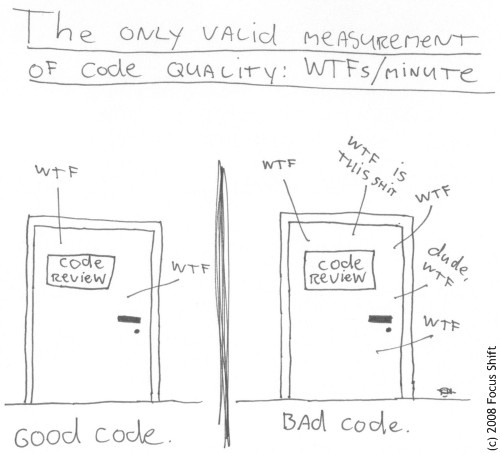

--

# Clean Code

* ... is not about formatting style

> Code I'm not afraid to modify

[g andrieu, Stack Overflow](https://stackoverflow.com/questions/954570/definition-of-clean-code)

--

# Clean Code (2)

* Easy to understand
* Easy to modify
* Easy to test
* Does not contain duplicated code
* Works correctly

--

## Code Rotting

* Code gets worse over time
* Code gets worse with number of developers <!-- .element: class="fragment" -->

Instead, every time you look at a piece of code, improve it a bit <!-- .element: class="fragment" -->

* Refactoring of names of variables or methods <!-- .element: class="fragment" -->
* Shortening of methods that are too complex/long <!-- .element: class="fragment" -->
* Deduplicate code <!-- .element: class="fragment" -->
* ... <!-- .element: class="fragment" -->

--

> `assert` No Indico Developer attending the workshop?

--

## What is wrong here?

    def daysInYear(year):
        days = 365
        if (year % 4 == 0 and year % 100 != 0) or year % 400 == 0:
            days += 1
        return days

--

## What is wrong here? (2)

	def generate_checksum(self):
        nnc = 'PREFIX{0}{1}{2}{3}'.format("%04d" % int(self.account.id), datestr, num, self.sender.id)
        checksum1 = nnc[-2]
        checksum2 = 0 + (1 + 2 + int(nnc[4]) + int(nnc[6]) + int(nnc[8]) + int(nnc[10]) + int(nnc[12]) + int(nnc[14])+ int(nnc[16]) + int(nnc[18]) + int(nnc[20])) * 4
        checksum3 = 0 + int(nnc[3]) + int(nnc[5]) + int(nnc[7]) + int(nnc[9]) + int(nnc[11]) + int(nnc[13]) + int(nnc[15]) + int(nnc[17]) + int(nnc[19] + int(nnc[21])) * 7
        checksum4 = checksum2 + checksum3
        checksum = 0
        while (checksum4 + checksum) % 10:
			checksum += 1

--

## What is wrong here? (3)

	def calculator():
		print('Welcome to this calculator!')
		print('It can add, subtract, multiply and divide whole numbers from 0 to 50')
		num1 = int(input('Please choose your first number: '))
		sign = input('What do you want to do? +, -, /, or *: ')
		num2 = int(input('Please choose your second number: '))

		if num1 == 0 and sign == '+' and num2 == 0:
			print("0+0 = 0")
		if num1 == 0 and sign == '+' and num2 == 1:
			print("0+1 = 1")
		if num1 == 0 and sign == '+' and num2 == 2:
			print("0+2 = 2")
		[...]
		if num1 == 1 and sign == '+' and num2 == 0:
			print("1+0 = 1")
		if num1 == 1 and sign == '+' and num2 == 1:
		print("1+1 = 2")
		[...]
		if num1 == 50 and sign == '*' and num2 == 49:
			print("50*49 = 2450")
		if num1 == 50 and sign == '*' and num2 == 50:
		print("50*50 = 2500")

