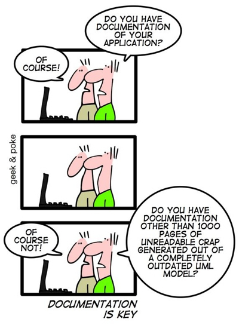

--

## Writing great documentation

* Documentation needs to be written for humans, not machines
    * Show real-life examples
* But more importantly
	* The documentation needs to be written at all
* Challenge <!-- .element: class="fragment" -->
    * Keep your documentation up-to-date while your code advances <!-- .element: class="fragment" -->

--

## Simplify the process

* Nowadays for documentation [Markdown](https://daringfireball.net/projects/markdown/syntax) is heavily used
	* There are many dialects and dozens of implementations in many languages
	* [CommonMark](http://commonmark.org) tries to standardise this
* Easy to learn
* Get the things done, **fast**

	# Heading

	## Subheading

	Your can include *italic* and **bold** texts easily.

--

## Caring about the enthusiasts

* For some people Markdown is not sufficient
* `TODO`: have a look at [reStructuredText](http://docutils.sourceforge.net/rst.html) (ReST)
* With ReST you can easily document your classes, methods, etc. to generate documentation

	"""
    Dispatch a call to a :py:class:`RpcServer` at ``_host``
    :param _host: host to connect to
    :param _port: port on host the server is listening add
    :param _name: name a payload is registered with the server
    :param args: positional arguments for the payload
    :param kwargs: keyword arguments for the payload
    """

--

## Documentation First

* A recipe for API success (to notes)
* Makes you think about your layouts

--

## Tools

* [GitHub Pages](https://pages.github.com)
* [Slate](https://github.com/lord/slate)
* [Sphinx](https://www.sphinx-doc.org)
* [Read the Docs](https://readthedocs.org)

--

## GitHub Pages

> Websites for you and your projects.

* We heavily made use of GitHub pages during this workshop to document the projects
	* Maybe you realised already ;)
* You can check each GitHub repository for related documentation
	* https://github.com/user/project becomes https://user.github.io/project

--

## Pants down

Did you write proper documentation when you implemented your features in `gksolite`?

* Adapt your documentation
* Build the documentation by utilising Sphinx
* Make it publicly available
