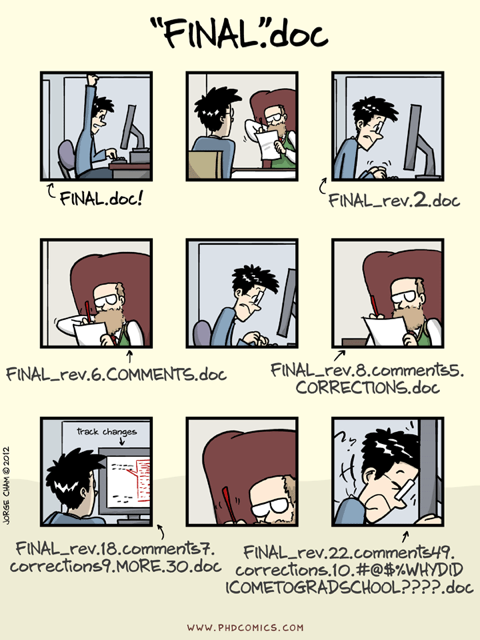

Note:
Image taken from [http://phdcomics.com/comics/archive.php?comicid=1531](http://phdcomics.com/comics/archive.php?comicid=1531)

Instead of having multiple copies of nearly-identical versions of the same document, some word processors enable tracking of changes (Microsoft Word, Google Doc, LibreOffice)

--

# Some Disadvantages

* No metadata about *what* was changed *when* by *whom*
* You lose track of what is going on
* You cannot easily roll-back to a specific working state
* Poor solution for collaboration

--

# Version Control

* Tracking of changes in files and set of files over time
* Record of snapshots of a current project's state via *commits*
* Sharing of changes in repositories
* Centralised (SVN, CVS) vs. decentralised (Git, hg)
* Implicit backup with possibility to roll-back to previous versions

--

# Git

We focus on `git` as an example for a decentralised version control

* Widely used in the Open Source world
* Easy to learn
* Variety of available tools
	* [Bitbucket](https://bitbucket.org), [GitHub](https://github.com), [GitLab](https://gitlab.com), ...

--

## Using `git` locally

	# Initialise an empty git repository
	$ git init

	# Put a file into your staging area
	$ git add <file>

	# This makes your commit.
	# To show what's in your staging area, use `git status`
	$ git commit -m "message"

	# You can also check what you did lately
	$ git show

--

## Useful configurations

Introduce yourself...
	
	# Configure your user name and email
	$ git config --global user.name 'Your Name'
	$ git config --global user.email 'Your email'

Configure auto correction for `git` commands

	$ git config --global help.autocorrect 1

Use colors to show `git` information

	$ git config --global color.ui auto

--

## Suppressing the noise

* Don't track junk or personal settings 

	$ echo ".idea/" >> .gitignore

* There are predefined templates for programming languages, operating systems, etc.
	* e.g. check [https://github.com/github/gitignore](https://github.com/github/gitignore)

--

## Daily workflow

* Pull
* Repeat
	* Work
	* Add changes
	* Commit
* Push

